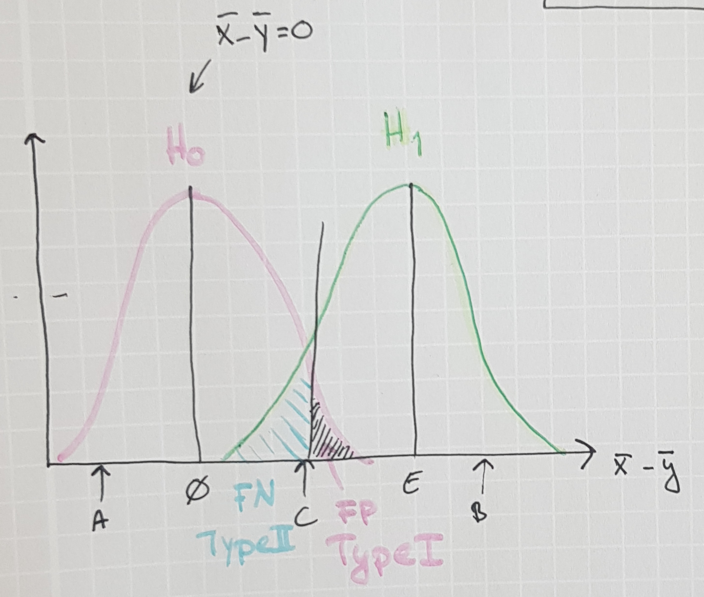

# Quastion and answers -- Hypothesis Testing

## Errors in presentation

* Q: Regarding the video:
    From minute 8:42, you say that "by placing in the situation where we say: There is no difference whatsoever between healthy and diseases populations, we want to access how big is the difference between that and the current one".  
   This would be the null hypothesis.  

   Continuing you talk about  "the observed differences in observed means as being extremely low. That there is little reason to believe that the *H0* is true. We reject the *H0* and conclude that there is difference  between the healthy and diseased populations."  

  As far as I understand, when you are rejecting the *H0*, the observed differences in observed means should be high, not low.  However, the sentence would make sense if we exchange the "observed differences in observed means" by the *p* value.  

  How does the "observed differences in observed means" relate to the *p* value here, or can that be interpreted as *p* value?  

  > A: This is indeed a mistake in presentation. In the fictive example, I should say "the observed differences in observed means as being large." That is very much the oposite to what was recorded in the video.

## Definition of *p* value

* Q: Could someone clarify how to calculate the *p* value? I hope it will help me to understand the difference between *p* value and probability.
> A: A *p* value **is a** probability. Specifically, it is the probability that an outcome as extreme or more extreme than the one encountered given the null hypthesis being true.

* Q: Until now, if someone would have asked me: "What is *p* value?" I would have answered that "it is the probability of the observed difference between the two populations to be due to chance". However, I did not find this definition in the reading material. Would this definition be wrong?
> A: Yes, your definition is problematic.  
> 1. In testing, we observe samples not populations. The hypotheses, however, are statement about populations.  
> 2. The definition of "due" is vague. Do you mean given the observed difference what is the probability that the observations happened by chance? Or do you mean the probability of the difference and that the outcome happened by chance?  

* Q: Could you clarify a bit about why the *p* value is uniformly distributed if the null hypothesis is true? Also what happens if the null hypothesis is false (the Wikipedia article mentions that the distribution then depends on sample size and the true value of the parameter)?  
  Q: In the video, you said 'when the null hypothesis is true, we are equally likely to observe a *p* value of 0.1 as 0.3 as 0.9.'  I don't understand it, could you give me a more detailed explanation of it?
  > A: The uniformity follows from the definition of a *p* value. If Xobs is generated under H0, the probability Pr(dX>=dXobs\|H0) is just Pr(dX>=dXobs), i.e. a [Cumulative distribution function](https://en.wikipedia.org/wiki/Cumulative_distribution_function). The null p values are uniform just the same way that a sample from any distribution, when subject to its own CDF, would render a uniform distribution between [0,1].
  > See e.g. [this stack exchange entry](https://stats.stackexchange.com/a/11288)

* Q: According to the Wikipedia article, there are two main issues with using the *p* value;
    1. The alternative hypothesis for any *p* value less than 0.05, without other support, is accepted
    2. That the *p* value is misunderstood as being the probability that the null hypothesis is true.

  Some proposed alternative to these issues are;  
    1. Replacing *p* values with e.g. confidence intervals, likelihood ratios or Bayes factors
    2. Remove the fixed significance thresholds and interpret the *p* values as continuous indices of the strength
    3. Report the real effect that would be required to obtain a false positive risk below a pre-specified threshold (such as the 0.05).  

  What is your opinion on these problems and solutions? Do you have additional solutions? What do you believe is the most important take-home message for us regarding these issues?
  > One suggestion that helped me in my life, is to take a course in Bayesian statistics, and to employ poserior error probabilities a.k.a. [local fdr](http://statweb.stanford.edu/~ckirby/brad/papers/2005LocalFDR.pdf) rather than *p* values.

* Q: The [Wikipedia entry](https://en.wikipedia.org/wiki/P-value) for *p* value talks about representing the data using the random variable X and using conditional probability to define the statistical significance. However, it states that X is valid only in non-continuous data sets and the simple definition needs to be modified in order to accommodate the continuous data sets.

  What are examples of both the continuous and non-continuous data sets and how does the definition change when it comes to continuous data sets? Further, if we talk about having a normal distribution of the data then doesn't that itself constitute a continuous data set?
  > A: The wikipedia entry tries to build up a rational for why the defintion of the *p* value does include a greater or equal sign instead of just an equal sign. See the [defintion](https://en.wikipedia.org/wiki/P-value#Definition_and_interpretation) of a *p* value in the subsequent section.
  >  
  > Alt answer: Non-continuous data can only assume discrete values and you can depict them like clearly separated dots. For instance age (in years) is a type of non-continuous distribution.  
  >  
  > As opposite, continuous data can assume every possible values within a limited or unlimited range: it means that the possible values are infinite and you can always have one more value between other two. For instance height is a type of continuous data.  
  >  
  > So you see that in a non-continuous distribution you can have a certain probability for X to assume a specific value, because the possible values are "limited": you can, for instance, count the number of persons having a certain age. On the other hand, in a continuous distribution the probability for X to assume one specific value is one over infinite (=0): what is the probability for a person to be 173.67809223... cm tall? The only thing you can define is the probability for that person to be, for instance, taller/shorter than 173 cm or to be between 173.0 and 173.5 cm.

## Critical values and significance levels

* Q: Could you clearify the concept of using critical values? When do you use this instead of *p* values, and what is the difference?  
  Q: What is the difference between *p* value and critical value? When do use which one?
  > A: A critical value is the difference that corresponds to a *p* value of a the significance level we decided up front. I.e. you might estimate that a *p* value of 0.05 corresponds to a difference of means of 3 kg of the weights of your two samples. Your critical value on a 95% confidence level is then 3kg, your *p* value treshold is 5%.  

* Q: In the Wikipedia article it is mentioned that some argue against the use of significance thresholds, that it could be sufficient to interpret the *p* value directly. What makes the use of significance thresholds important, other than to be able to state if a hypothesis can be rejected or not?

* Q: Regarding the critical values, what could be good examples of distribution-free/ nonparametric data?

* Q: When you pick a value for your significance level, what should your approach be? How do you know which value is most suitable for your hypothesis? Why are 0,05 and 0,01 the most common ones?  
  Q: By convention the significance level is set to 0.05. How do you justify the choice of a different significance level? Would it be considered unethical to re-perform an experiment with a different significance level due to unsatisfactory results, or is this common?
  Q: What is the criteria for selecting the significance level for *p* value for a certain data? And won't accepting alternative hypothesis create inaccurate results?

* Q: What does the term "test statistics" include when comparing to critical values? What is used instead of *p* values in comparison?

## Type I vs. Type II errors

* Q: Both type I and type II errors are commonly present in the statistic analysis and when interpreting the results the errors should be taken into account since the significant levels that are set make the existence of an error probable. Could such an error be detected and is there a way to avoid false positives or false negatives with the already established significance levels?

  > A: No. That is the point of the whole point of significance testing. Regardless how you select your threshold, there will always be errors. The question is just if you prefer errors of one kind over the other.
> An illustation of this is given by this fictive cenario. Say trhat you actually would know the distribution of the
> Given a cenario where you know the diffeerence between the means, *E* of two populations under the alternative hypothesis, (you normally do not know this, you normally just asume that the difference is not zero),  and the distribution of your measurement errors, you observe the possible outcome below.  
  
> Given a measurement of a difference in sample means of *C* there is a sizable probability that the measurment was generated either by H0 and a sizable probability that it was generated under H1. This is the reason why we need statistical tests: we want to assess the probability of an error if we accept or reject H0.

* Q: How can we get low levels of both type I and type II errors? In which situations would we want to prioritise low type I errors over type II errors (and vice versa)?

* Q: Why are type I errors usually considered more dramatic than type II errors?

* Q: How do we take the different kinds of errors from our hypothesis testing into account when we want to calculate the *p* value?

## One- vs two-sided tests

* Q: What is the rationale behind using a two-sided *p* value? For instance in the example on the Wikipedia page of testing whether a coin is fair, I understand that it can be biased towards either heads or tails, but in what way does a two-sided *p* value relate to the observed result?  
Q: When to use one-tailed *p* value and when two-tailed *p* value?  
Q: What are the differences between one side p value and two side p value? Can you give us an example in real case where both of the two p value are meaningful?
  > For instance if you are interested in the differential expression between two samples, you usually want to know only when a gene is expressed at different levels, without considering whether it is over-expressed or under-expressed. In this example the significant  "over-expression outcomes" (i.e. when the average difference is positive) would fall in the extreme right of the distribution, while the significant "under-expression outcomes" (i.e. when the average difference is negative) would fall in the extreme left of the distribution. Since you're interested in both the types of outcomes, you collectively consider them using the two-sided *p* value.  
  > A [wikipedia](https://en.wikipedia.org/wiki/One-_and_two-tailed_tests) entry on the topic.

* Q: So in which example would we use a two sided *p* value? Isn't the most common usage the one sided *p* value?
  > If you want to test that the difference in the mean between the population parameters *only* is poitive *or* negative you use a one sided test. If you want to test that the difference in mean *both* for positive *and* negative changes, you should use a two-seide test.

* Q: Which test, one-tailed test or two-tailed test, should one use for a dataset obtained from experiments (e.g. sequencing)? How can one know if the choice of the test is appropriate?

## Probability distributions, and sampling distributions

* Q: I would appreciate further clarifications on the differences between parametric and non-parametric tests. What are the different assumptions underlying these tests?

## *p* value hacking

* Q: Like other statistical based sciences, biology is struggling with *p* hacking and a replicate crisis. How is *p* hacking performed (just out of curiosity) and how can it be revealed and identified?  
> A: This cartoon (and it's explanation) explores the problem:  [XKCD](https://www.explainxkcd.com/wiki/index.php/882:_Significant)

* Q: Are there any examples of when it would be justified to perform some sort of Post-Hoc tuning?

* Q: What is considered *p* hacking? For example, BLAST sites report separate *p* values for each alignment which is calculated after alignment rather than us (necessarily) setting a predetermined p value against which alignments are rejected. And we usually just include that value as a *p* value for our findings. I ask because of this quote in the reading material: "It also does not mean that you can choose your *p* value after you run the test."

## Null hypothesis (*H0*)

* Q: Why do we need null hypothesis, why cannot analysis whether or not the data fit the alternative hypothesis directly? If we calculate P(data\|H1), and compared with significance level, can we get result to reject H1 or fail to reject H1?
> A: The problem is that we know very little of H1. Under a typical H1 the difference in mean can take any value except for zero. This is why one one at least historically could not model probilities related to H1. H0 on the other hand, asumes a fix value of the difference in mean, e.g. 0, which enables us to estimate the distribution of measurement errors around that value.

* Q: How to ensure the null hypotheis when using t-test? How to define "the situation we are not interested in"? Does it have a impact on the selection of formula?

* Q: If the *p* values are uniformly distributed by definition, how can we trust the result of a statistical hypothesis test that e.g. gives a *p* value of 0.1 (if we are equally likely to observe a *p* value of e.g. 0.9)? Does this mean that a difference between populations could be statistically significant at first, but not statistically significant if the measurements were to be repeated of the same sample groups?

* Q: How to select suitable test type in a specific case for the hypotheses testing?

* Q: In the code one explanation said: "It is generally assumed that expression values follow a log-normal distribution" What does this mean and why do they follow a log-normal distribution?

* Q: How does one approach calculating the *p* value if there is no knowledge on the underlying distribution? Do you simply try and justify your choice of test?

* Q: How would you define the way to get the null and alternative hypotheses?  
  I think when we have a research question it could not be answered in a yes or no way. If possible, how would we do it?

* Q: What is different with composite hypothesis compared to a simple or point hypothesis regarding the *p* value? (Wikipedia Article)

* Q: The concept of "composite hypothesis" is not very clear to me.

* Q: If the *p* value is uniformly distributed given that *H0* is true, the probability distribution plot would be a straight line. When we look at *p* values, we see a normal-shaped distribution. Is this the *p* value distribution assuming that we can reject the null hypothesis? If so, aren't we assuming that the *H0* can be rejected from the beginning instead of testing it?

## Sampling process

* Q: Is there any relation between systematic and random errors and biological and technical variation?

* Q: In biological situations, we consider random samples from 2 populations. Is there a possibility of mix up either due to false positives and false negatives within the two populations? If so, how do we fix the error obtained?

## Design of Experiments

* Q: In the Wikipedia article on *p* values it is stated that since the *p* value isn't fixed and changes during repetitions of the same test of the same H0 you can combine them by for example using Fisher's combined probability test. How is the confidence level affected by this, i.e. the combination of the *p* values? Do the repeated tests need to use the same significance level in order to combine the *p* values?

* Q: How can we interpret high *p* values or identify weak correlation in our data? And what are alternatives to the *p* value to interpret correlations in data ?

* Q: What is an alternative way to reduce both Type I and Type II error simultaneously, except increasing the sample size?

* Q: How to reduce the errors except choosing a lower significance level.

## Notebook

* Q: From the "Differential expression analysis of the TCGA breast cancer set", what is a fold change and how is it calculated? Why do we use volcano plots to view differential expression values?  
  > A: See [wikipedia](https://en.wikipedia.org/wiki/Volcano_plot_(statistics)).

* Q: In the DE analysis notebook, I understand that the -logp values are used for the volcano plot to make the interesting values stand out more, but is there something else you can use the -logp values and logFC values for?

* Q: How valuable information does Differential  Expression Analysis really yield? Does a higher fold change necessarily mean a higher impact on the phenotype in question (e.g. breast cancer)? There is also no way to investigate causation, only correlation. Does this mean Differential Expression Analysis always requires extensive further investigation before solid conclusions can be drawn?

* Q: How can we determine which of the contrasting hypotheses should be the null hypothesis vs the alternative hypothesis? For example, would it be preferred to use  "Gene X regulates protein Y" as the null hypothesis or "Gene Y does not regulate protein Y"? What should we consider when making this decision?
