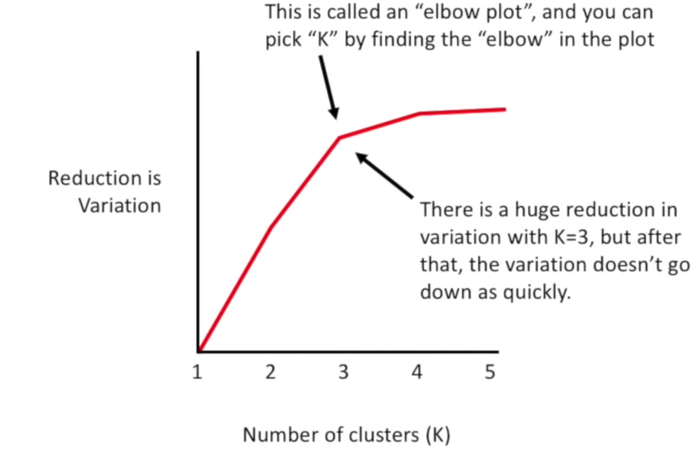

2. Voronoi cells
1. MultiNormal distributions
1. Walkthrough of k-Means
3. Walkthrough of GMMs
4. Optimization
6. Determine k
   -  AIC/BIC 
1. Generative models.

# Questions and Answers on Clustering.

### Initiation of k-Means

1. In the "caveats of expectation-maximization" part of VaderPlas on k-Means Clustering,  it said "if we use a different random seed in our simple procedure, the particular starting guesses lead to poor results". Why? What is the meaning of random seed and how does it influence the results?
   > EM will maximize likelihood in whatever direction is closest. This might be towards a local maximum. Hence you should restart the algorithm several times from different starting points.  
   >   > The random seed or `rseed=x` in the code calls back to  `rng = np.random.RandomState(rseed)` in the function `find_cluster`. If I understand it correctly, it means we chose random the starting points of our clusters. In the case of Caveats we have "find_clusters(X, 4, rseed=0)" so we choose 4 random starting points for clustering and due to the randomise it could be that the cluster generated make no sense on a globally level.
   >   >    > I think that the sentence you mentioned ("[...] lead to poor results.") is meant in the specific example that is shown below that passage. You can observe that the same k means algorithm done again on the same data set led to a different clustering (of bad quality this time). The only difference was that the starting points of the clusters were different. This shows how k means clustering fails to find a global optimum. To prevent this, k means clustering is usually repeated several times with different starting points.

### k in k-means
1. In k-means clustering, how can you predict the number of clusters you have?
   > If you know what type of data you have you can probably decide based on that. For example, if your dataset contains sequencing information from tumour tissue and healthy tissue you would probably expect 2 clusters as there is 2 different groups in the dataset. If the data is simple enough you could also plot and decide how many clusters you see in the data.
   > > Two ways that I found to be commonly used are the Elbow method and the Silhouette method. They both use the resulting clusters from different values of k and uses the distance between the data points and their cluster center to determine the best k by looking at when the distances are optimised and won't be helped by adding another cluster. There are also other ways, wikipedia has an article covering the two I have mentioned as well as some others. Link: https://en.wikipedia.org/wiki/Determining_the_number_of_clusters_in_a_data_set  
   > > > Yes I think the elbow method is good. You plot the reduction in variation against the number of cluster k and the elbow (highest reduction in variance and lowest number of cluster) is an optimal value for k. (screenshot from StatQuest k-means clustering)
   
   > > > On top on these good suggestions, one could add that many people like the [silhouette method](https://en.wikipedia.org/wiki/Silhouette_(clustering)) to determine a good number of clusters. Neither of these methods are perfect though.

1. In the section about GMM under "## How many components?" the authors were writing about the model being generative. I found the description to be difficult so what does that mean? Also, AIC and BIC were used to determine the optimal number of components but how does this work?
    > About the model being generative, they explain it in the section above as follows: "Here the mixture of 16 Gaussians serves not to find separated clusters of data, but rather to model the overall distribution of the input data. This is a generative model of the distribution, meaning that the GMM gives us the recipe to generate new random data distributed similarly to our input. For example, here are 400 new points drawn from this 16-component GMM fit to our original data:" I found this explanation helpful to understand the difference between generative and discriminative models: https://developers.google.com/machine-learning/gan/generative

1. In general, can it be a problem to have very small clusters? If yes, is it common practice to set a minimum number of data points that a cluster must contain?
   > As I see it, the ultimate goal of clustering would be to categorize data so that the comparison between clusters becomes meaningful. In this case,  you can only draw conclusions if each cluster contains enough members per subgroup, or if the clusters are very well separated. In this [paper](https://bmcbioinformatics.biomedcentral.com/articles/10.1186/s12859-022-04675-1) about statistical power in cluster analysis, they recommend aiming for sample sizes of N = 20 to N = 30 per expected subgroup.

### Voronoi boundaries

1. In the section on k-means clustering, it says that k-means clustering is limited to linear cluster boundaries. What is the reason behind this?
  > Let's say you have two clusters. The boundary that classifies data points to a cluster is exactly the same as a hyperplane that we discussed in the previous module. This is a linear boundary as it is a straight line. This line is exactly 90 degrees perpendicular to the crossing of the two circles that have the centroids as middle points. Increasing the number of clusters will only increase the number of linear boundaries that separates the clusters, but it does not change the shape of these linear classifiers. For that reason, GMMs are required.
  > > For me in k-means clustering, you are limited to circular boundaries but sometimes your cluster is elliptic and the circular boundary will not be the best fit so thus you need GMM for a better fit. Why is it linear is a good question, maybe because you just measure the distance between the data points and the cluster without considering the covariance.
  > > > A more technical answer is that k-means only work for euclidean distances. A detailed discussion can be found [here](https://stats.stackexchange.com/questions/81481/why-does-k-means-clustering-algorithm-use-only-euclidean-distance-metric).

### EM-algorithm

1. It is mentioned, that "under typical circumstances, each repetition of the E-step and M-step will always result in a better estimate of the cluster characteristics.". Is there a possibility for an E and M step  to result in progressively worse estimate of the cluster characteristics, after specific number of iterations has been reached?
   > The EM algorithm guaranties that it always will improve or keep the likelihood of the model, so in that sense more steps cant hurt the  clustering.  
   > > In principle, it cannot. During every E and M step your clusters converge more as more data points are added adequately to each cluster. This means that after each iteration your centroid positioning will stabilize more. It should be noted that your clustering quality is highly dependent on the number of clusters you choose initially. 
   > > > In the text "in-depth K-means clustering" there is an example where the initial centers of clusters (randomly assigned) are poorly positioned and therefore result in "bad" clusters. But it was also mentioned that a quite easy way to correct this is to run the cluster generation multiple time (and the chance of bad clusters is therefore diminished). As Alexander said, the quality of clusters is strongly dependent on the number of clusters you choose to place. It is therefore important to visualize the data before choosing the number of clusters to generate.

### Feature importance in GMMs

1. In the video, it was stated that GMM:s allow you to weigh different features differently for clustering, but I didn't quite find how this was done in the reading material. I understand that this is a prerequisite for being able to construct non-spherical clusters, but how does this work? Do you simply scale the different dimensions differently by multiplication or is it more computationally involved?
   > The fact that non-spherical boundaries can be created depends on that GMM allows for non-zero covariance of the variables, and that the boundaries of the clusters can be reshaped based on the probability distribution of each datapoint belonging to cluster-centers. For instance, if one datapoint near the boundary of one cluster is more likely to belong to a neighboring cluster, that datapoint probability will be weighed in when reshaping the boundary. The fact that in GMM non-zero covariance can be achieved, means that the boundaries can be elliptical. In contrast, k-means clustering does not take into account any probabilities (i.e.: Hard cut-off boundaries), and the covariance of variables is zero (i.e. the boundary can only be spherical).

1. In the section about GMM, they mention that the covariance type hyperparameter must be set carefully for any given problem. How do you choose what to set it to? What is it based on?
   > For my own experience on Bayesian analysis, I would say it usually based on previous knowledge of those biological processes. One of the strategies to validate the GMM result would be Effective Sample Size. It refers to ”effective” amount of data involved in modeling individual components.
   > > This is right! You should ask yourself if you think it is reasonable that the features e.g. co-variate in the problem. 

### Data dimensionality

1. In the VaderPlas on k-Means Clustering, it says 'These two disadvantages of k-means—its lack of flexibility in cluster shape and lack of probabilistic cluster assignment—mean that for many datasets (especially low-dimensional datasets) it may not perform as well as you might hope.' In our previous lecture and reading materials, we have known that there are some methods to transform the low-dimensional datasets to high-dimensional datasets. Since we could transform the dimension of our dataset, why not we perform the k-means in the higher dataset (k-means is also an easier approach to perform comapared to other approaches)? Is it computaionally complex or difficult? 
   > High dimensional data is not used for clustering and is generally tricky to work with because of the curse of dimensionality. In machine learning, it causes some phenomena like: "with a fixed number of training samples, the average (expected) predictive power of a classifier or regressor first increases as the number of dimensions or features used is increased but beyond a certain dimensionality it starts deteriorating instead of improving steadily". So, it is more favourable to work with lower dimensional data. https://en.wikipedia.org/wiki/Curse_of_dimensionality
   > > Often the inverse is done, e.g. we use dimensionality reduction methods before clustering.

### Validity of k-Means

1. I wonder if there is any way to validate a clustering? It is mentioned in VaderPlas, k-Means Clustering that there is no assurance that the E-M procedure will lead to the global best solution. How can you tell if you have reach the global best solution or not? Given two different clusterings of a same dataset, is there any method that we can use to assess which one is better, other than just looking at the graphs?
   > From what I found you can indeed to some extent validate the results from your clustering algorithm but in the end, it depends on your data and it's important to put the results into context. An example of validation is the so-called internal cluster validation, where you measure the connectivity of the data points in your cluster, the compactness and separation to other clusters. A "good" cluster would then be considered a compact cluster with big separation from other clusters. Another approach is external validation. Here you validate the clusters based on an external dataset for which you know the real clusters before and then compare it to the clusters generated on your unknown dataset.
   > > I do not think there is a "global best" solution, since the validity of the clustering really depends on the type of your data. Howvever, there is some ways to validate or evaluate clustering. We can look at the cluster cohesion and cluster separation of the clustering. The example of the cluster cohesion measure could be SSE. By calculating SSE, we could tell how closely related are objects in the cluster. And the cluster separation could be squared error. To calculate the squared error, we could tell how distinct or how well separated a cluster is from other clusters.

### k-means vs GMMs
I found this thread helpful when comparing the [two methods](https://stats.stackexchange.com/questions/489459/in-cluster-analysis-how-does-gaussian-mixture-model-differ-from-k-means-when-we).

1. Is there any practical benefit of using k-means as an unsupervised clustering method instead of GMM due to the method's limitation in for example requiering you yourself to identify the number of clusters beforehand by using silhouette analysis?
   > If you has already known how many groups it should have, for example, the subtypes of Breast Cancer, k-means have a lower running time requirements than GMMs. 

1. In the section: k-means can be slow for large numbers of samples, it is stated that "Because each iteration of k-means must access every point in the dataset, the algorithm can be relatively slow as the number of samples grows." However, won’t a GMM model be equally as slow, iterating over the E- and M- step until converging?
  > I agree. Since they both follow the same iterations, they should take the same amount of time. However, with further model complexity of GMMs they may in practice take even more time to cluster.

1. In the last sentence before the examples in In depth: Gaussian Mixture models, the author writes: "I'd encourage you to think of GMM primarily as a density estimator, and use it for clustering only when warranted within simple datasets." What is the reason for this? To me, a density gradient seems to be a vital criterion for identifying clusters in the first place, where the only issue occurs when clusters overlap. In other words, GMM seems superior to k-means.
   > GMMs for clustering makes most sense if you have reasons to believe that your data follows a multinormal distribution. If not the difference between the algorithms is that all the datapoints contributes to all cluster means (but with different probabilistic weights) in GMMs, while each datapoin only contributes to one cluster in k-Means.   
   > I think it makes sense to think of this statement in relation to the k-means clustering. There, clusters are roundly shaped around a mean, regardless of density of the datapoints around the mean. This becomes an issue when you have data which is not shaped as circular clusters, but rather more distributed over a line. Gaussian models can prioritise density over mere distribution of datapoints, which makes them superior for dealing with data such as the spiral-shaped data from the readings.

### Notebook
1. What is the meaning of random_state in KMeans? Why do we set it to 0? 
  > The random_state is used for initializing the internal random number generator that's used to split up our data into the two different clusters that we had in the example. It doesn't matter which number you set, as long it's an integer. The reason why we have a fixed value on random_state is to make sure that we get the same numbers every time we run the code (so that we don't randomly assign the datapoints into new clusters every time). 
  > > This can also be seen as an alternative means to control the [seed](https://en.wikipedia.org/wiki/Random_seed) of the randoms number generator.