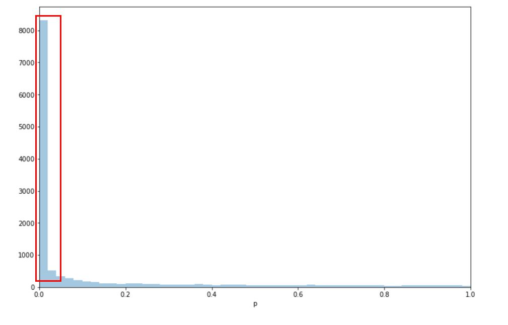

# Questions and Answers to Multiple Hypothesis Testing.

## Conservative vs. anti-conservative measures
1. In the Storey and Tibshirani paper, the authors write that for instance the Bonferroni method is too conservative. Generally the term conservative comes up quite often in statistics when comparing hypothesis testing methods. Now I would like to know what makes a method conservative, how do the results differ and when conservative methods are appreciable?

1. The paper mentions that their proposed methodology is conservative in nature, but also that the old method (Benjamini, Y. & Hochberg) is very conservative. In statistics, since everything is about a perspective/ point of view how do we decide what makes a technique conservative?

## Nomenclature
1. How is the expected number E calculated in the FDR function?
> E[f(x)] is the [expected value](https://en.wikipedia.org/wiki/Expected_value) of f(x).

## Error types
1. As I understood from the multiple hypothesis testing video, FDR gives you the expected value of getting a type I error (false positives), but how do you calculate the probability of making a type I error at all?, and how does the FDR affect the type II errors? Is it crucial to have a balance between type I and II errors in a research?

## Monotonic functions

1. FDR is not monotonic and we use Q-value to control FDR. After applying the Q-value, we can see a monotonically decreasing function with score.  Why we emphasize the monotonicity of FDR? Is there any importance of monotonicity?

1. Why is it important to have a monotonically decreasing function of q/FDR plotted against the score?

1. What does it mean “the q-value ensures monotonically increasing function with the p-value threshold” (taken from the slides)? How and why? (I don't really understand this part)
> The  *q* values are semi-[monotonically](https://en.wikipedia.org/wiki/Monotonic_function) increasing with *p* value. This is done by smoothing the FDRs into *q* values by defining a feature's *q* value to be the minimal FDR of any treshold that includes the feature. The procedure is important as we otherwise would not be able to allocate a FDR treshhold to a particular feature (, as there will be multiple such FDRs).

1. In the paper it is mentioned that the estimate for the q value is conservative and that the proportion of false positives is not underestimated. The q value is defined as the minimum FDR when a certain feature is called significant. Wouldn't that underestimate the number of false positives when it is the minimum FDR?
> No it is the minimal FDR of all tresholds including the current finding. That is different.

1. Could you explain the concept of monotonicity and its importance? I did not fully understand that part.

## Multiple hypothesis testing

1. How is the introduction of the q-value related to the measurement of several features at the same time? As I understand it, the FDR and FPR can both be used for single feature measurements, I don't understand what the added value is for multiple hypothesis testing.

1. By choosing the FDR (and subsequently Q-values) under a certain P-value threshold we put emphasis on not wanting too many FP in the results we deem significant. In situations where only a few hypotheses need to be confirmed (such as differentially expressed genes, where only a handful of targets need identifying as drug targets), this makes sense.  
However, is there a way that would minimize the number of FN, so that as few samples under alternative hypotheses are missed as possible (for instance detecting tumors in patients, where it is better to make a return visit than miss the cancer)? Can FDR/Q-values be used for this, or are there separate methods?

1. How is introducing the q value correcting for multiple parameters being tested?

## *q* value vs. FDR

1. From what I understand the FDR approach presented in the paper by Storey and Tibshirani is more accurate in some cases than other FDR estimates, as the Bonferroni and Hochberg procedure. Is this solely because of the π0 estimation or are there other differences that also affect the accuracy?
> Yes, that is the main difference.

1. What is the difference between the q-value and the FDR adjusted p-value? Are these terms interchangeable?

1. What is the difference between the Benjamini-Hochberg procedure for controlling the FDR and the procedure presented in the Storey & Tibshirani article (also in terms of accuracy)?

1. When reading about Multiple hypothesis correction, I came across 3 different methods.
   1. Bonferroni (conservative) method - resulting in loss of True positives( significant values)
   2. Benjamini and Hochberg method - Adjusted P value depending on rank and number of hypothesis.
   3. Q value method (Storey) - FDR adjusted P value. ( min FDR to include)    
I was unable to make a clear differentiation between Benjamini-Hochberg method and Q value method by Storey. Could you explain how they are different? Also give an example of a scenarios where you would use one over the other?

1. I am wondering what makes contrast between family-wise error rate (FWER) and false discovery rate (FDR) while both of them are estimation of type I error?

1. Are there any values other than p- and q-value that can account for sensitivity and specificity instead of only FDR?

1. How would you handle p-values and FDR-adjusted p-values if you are comparing results from multiple sources? For example if you look at differential expressed genes for condition A and some research done in a smaller scale on only a few genes present p-values and some larger studies present FDR adjusted p-values. Can you compare and merge the results from those different kinds of studies?
> You convert them to *q* values.

## Uniformity of *p* values
1. From what I understand, estimation of the False Discovery Rate (FDR) assumes that p values are distributed evenly under the null hypothesis. In the paper from the reading material it is mentioned that "if the null p values are not uniformly distributed, then one wants to err in the direction of overestimating p values".  
What could be the reason for null p values not being evenly distributed? I thought they would be evenly distributed kind of "by definition" of being null. The only explanation I can come up with is a smaller sample size where, by chance, it happens to be so that null p values are not evenly distributed.
> *p* values are evenly distributed under null, however, *p* values from the alternative hypothesis are not.

## π0 estimation

1. In the jupyter notebook, π0 is estimated by two different methods; bootstrap and spline. In the notebook, the methods yield slightly different results. I’m wondering whether one of these methods is generally preferred over the other?

1.  Both methods (bootstrap and spline) estimate a very low 𝜋0 (0.1847 and 0.1938), indicating that most of the genes (80%) are differentially expressed in the triple negative cancers. Can we already infer that from the first plot shown in the notebook (attached)? Since the p values from non-significant genes should be uniformly distributed, we can already detect a disproportionate enrichment on extremely low p-values (highlighted).
   > Yes, the low  value of π0 is quite visible from the plot.

1. For bootstrapping: how many samples for each iteration is generally considered to be a good amount? Or should one simply use the same as the sample size since computers are generally powerful enough to handle that easily?
In teh sample code I use 100 bootstarps, which should be more than enough.

1. In your YouTube presentation you talked about π0 estimation and that π0 (as an estimate) was plotted against λ. In that plot the higher λ that was chosen the more variance it was for π0 which you said was due to the sample size or data set being small. So if we would increase the sample size would this variance decrease, assuming under a constant λ.

1. In the jupyter notebook π0 was estimated with bootstrap and spline. Are there any other methods used to estimate π0? How do you decide which one you should use?

1. I had some trouble grasping the concept of lambda, is it possible for you to elaborate on this? What is the definition of lambda? How are the lambdas chosen when estimating π0? For example in the jupyter notebook why is maxLambda set to 0.95 (and not to 1) and why is the number of lambdas set to 100?

1. In the article as well as in Jupyter notebook π0 was estimated using a cubic spline. I was wondering whether the spline is used only as a reference or does it have any other use besides smoothing the data?

## General
1. John D. Storey and Robert Tibshirani say in their article
"The q value provides a measure of each feature's significance"
but how does this relate if there are several features that together create the result?
I'm thinking of cases where some genes are either activated or inactivated independently of each other but all contribute to the effect.  
 > The *q* value relies on that the underlying *p* values are independent.

1. Is it possible to choose different threshold values for different hypotheses? If so, would this achieve anything other than locating which subset of hypotheses maximizes the overall threshold we must have for a given q-value?

1. Is there any convention for q-value threshold in multiple hypothesis testing? Also, I have heared about other methods to overcome multiple hypothesis testing problem such as Bonferroni correction, is there any preference regarding which method should be chosen? Is q-value the best method?

1. Could you explain the concepts of π0 and q-value with examples? As I find the definitions rather abstract.
> I like the examples given in Storey&Tibshirani.

1. Is there a downside of using q-values instead of p-values even for lower numbers of tests (for example 5) in the same sample or is it explicitly preferred for really large numbers of test (for example 1000)?

1. In the provided paper, they say that it is important to reduce false positives in genomic studies but not too much as it would lead to missed findings. They also describe the balance between false positives and true positive features derived from the FDR. However, is there a reason why it’s important to consider false positives over false negatives in genomic studies? And are there situations where false negatives are more important than false positives?

2. In the figure 2c in the paper the 'jump' at q = 0.02 is pointed out. This means that by changing the threshold for the q value a little, many more genes are considered significant. What would you do in such a case in the study and what could be the reason for that?  
Does that mean that those genes have a similar log fold change or p value?
> This just means that there are many genes with similar *p* values.  

1. In multiple hypothesis testing, are we assuming that H1 probability distribution is the same for all features? Could this be an oversimplification and possible source of errors?

1. You also said in the YouTube lecture that we cannot know, in practice, which of our findings are null type and which are alternative types - we can only estimate for FDR. How can we know then the validity of FDR, sensitivity, and specificity we have calculated?

1. In the first example of the article they say: "A rough calculation shows that about three false positives are expected with this cutoff. These authors later used a threshold of 0.0001 and concluded that 9–11 genes are differentially expressed."
How do they conclude that the threshold is valid? Can't the author pick any threshold and when is it a good threshold?
> They just selected a treshold. The point is that one should not use *p* value treshlds.

1. In a multi-feature dataset, is the false discovery rate calculated for the dataset as a whole, or is it calculated with regard to one specific feature of interest?   

## Notebook
1. In [jupyter notebook](https://nbviewer.jupyter.org/github/statisticalbiotechnology/cb2030/blob/master/nb/multiplehypo/qvalue.ipynb), the optimal Pi0 has been calculated by function estimatePi0 and it is used in the next function to generate FDR. However, why is Pi0_hat counted in the function of qvalue, and what is the meaning of it? From the results figure, the distribution of Pi0_hat values is just a decreasing string with approximate 1 declining to 0,  from the first gene to the last one.
> This is a residual from last years teaching. The Pi0_hat is implemented in the same manner as the Storey&Tibshirani paper, and the bootstrap method is not used.

1. The notebook contained Bootstrap and Spline methods whose results varied slightly. Are there certain criteria to choose between these methods?

## Other questions

1. When doing a global test (such as ANOVA = Analysis of variance) to compare multiple groups simultaneously and thus generating only one p-value in order to reduce type I errors, is that same as/or related to doing a permutation of the samples or is this something totally different?  
 > "Global test. A statistical test that compares multiple groups simul- taneously, generating only one P value. For example, ANOVA tests the global null hypothesis that several groups’ means are equal. If the null hypothesis is rejected, this indicates that at least one mean differs." - https://doi.org/10.1016/j.pmrj.2009.10.004

1. What might a p-value distribution look like such that min(FDR(t) | t >= pi) does not equal FDR(t)?
>  I do not get this question.

1. How can we adjust FDR to detect and avoid False Positives? Which would be the better way to determine in clinics true and false positives? How can we apply all this to the current situation and the apparent false positives on Sars-CoV-2 situation?

1. If I understood correctly, FDR estimates the error rate among the significant findings of a rejection region. Is there any estimate that takes into account the fasle negatives, so the findings under the alternative hypothesis that are outside the rejection region?

1. The method of using FDR allows for the significant reduction of false positive results. Did the introduction of this statistical test retroactivley invalidate any prior findings or studies utilizing tradtional statistical tests in any way? If so are there any examples of papers that were corrected following?
> Storey&Tibshirani is an example of such a paper.
