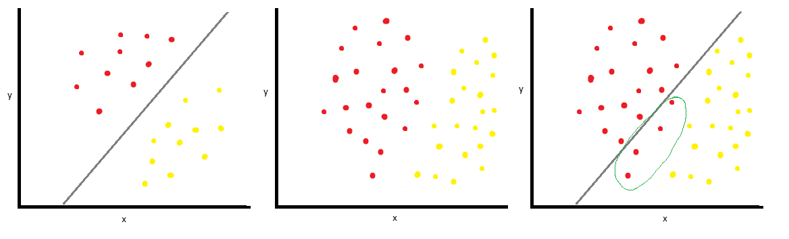
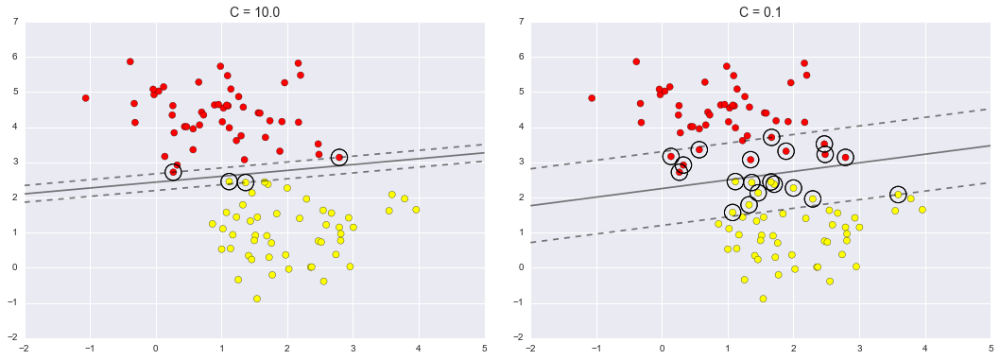

# Questions and Answers to Supervised Learning.

## Supervised ML

1. Can the machine learning algorithm become better than the quality of the data? Say we have to label the data as positive or negative but we are only correct 90% of the time will this then also be true for the algorithm?  
> Yes, normally manually annotated labels are incorrectly set, and some ML algorithms can to some extent overcome such problems. However, it is tricky to prove that you improve on manual annotation, since you do not have any ground truth.

1. The hyperplane is used to separate data in a n-dimensional space. Instead you could also do a complexity reduction (e.g. PCA) and then apply a linear function (or one with low dimensionality) to separate the data. Is the hyperplane more precise as no complexity reduction is carried out? Is one of the methods preferred in certain cases?
> Supervised ML is preferred when you trust your labels, and often for lower dimensional problems. Unsupervised ML is preferred in other cases.

1. Supervised Learning such as SVM are based on creating a classifier from an annotated dataset. Does this mean that the classifier only can get as precise as the annotations in the dataset? Can a small set of erroneous annotations ruin a dataset? How is this in contrast to unsupervised learning?
> Yes and Yes! In unsupervised learning there are no errornous annotation to ruin your classification.

## Over-fitting to data

1. I understand that a consequence of too many dimensions, especially when the number of dimensions surpass the number of individuals in the training set, is making the algorithm overfit the data. Is there any recommended maximum limit for the number of dimensions based on the number of points in the dataset?
> No, it depends on the problem. A bit circular: You should include as many features as needed, but not more. There are some theory associated with the number of selected features like [Aike's Information Criteron](https://en.wikipedia.org/wiki/Akaike_information_criterion), however, it is nort always applicable.

1. When finding training data for creating a support vector machine it was stated in Noble that support vector machines have difficulties differentiating between data from samples taken with different methods. However if you would want to expand your available testing or training data how similar does your data need to be in order to not compromise the SVM.
> When designing a classifier, you need to make sure that your training data is representative for what you [actually want to classify](https://www.youtube.com/watch?v=t4DT3tQqgRM). SVMs are not very different in this than any other classifier.

## Training vs. Test sets

1. Can the quality of a training set be judged by looking at the predictive power the resulting trained algorithm has on the test set?  If not, how can you assert the quality of a training set - i.e. when is a training set sufficiently broad yet representative.
> You know that you have a good training set when you get good performance on a classifier trained on the set. However, if you get low performance, it could be an indication that the design of your classifier and not the training set is to blame.

1. You mentioned in the video lecture that we need to optimise hyper-parameters by another separate test dataset. Why is it that we cannot optimise the hyper-parameters from the training set?
> We can set hyper-parameters based on training data, but we might overfit.

1. How can we define the statistical significance of hyperplane, margin, etc. ?
> We measure performance based on test sets?

1. 
Is there any risk of a hyperplane in the real data to be off enough, that some data could be misinterpreted? And if so do we just disregard that kind of data?
> Yes, a classifier's performance is based on its ability to generalize from training data.

## Soft margins

1. What must be taken into consideration when we choose the soft margin parameters?
> That your classifier should work well.

1.   
About the softening Margins in VanderPlas:  
We have a plot shows the data have the overlap. Then basically if we don't project them into a higher dimension, we should not able to find any maximum margin hyperplane between them.  
As I understood that C has an ability that adjusts the SVM so that small C will allow points to go into the margin. Indeed in the figure C=0.1 we got more points inside the margin, and C=10.0 still strict for points that not entering the margin. But where are those overlaps? Why the overlap disappeared if we do the softening Margins?
> Not sure that I understand what you mean with overlap in this context.

1. Is it a lot more complicated to have a complex separation that follows the maximum margin principle but with no misclassified samples (no soft margin)? Is that kind of algorithm ever used, or do we always prefer a hyperplane with a soft margin?
> No that is the easy case. We introduce soft margins to take care of less clear or outlier datapoints.

## Hyperplane

1. Is there a way to score the effectiveness of a kernel function in mathematical terms, rather than just looking at the result? Why aren't nonlinear "hyperplanes" used more often (or linear hyperplanes transformed by the inverse of a kernel function)?
> A hyperplane is easy to express. A kernel is warping the feature space to be separable by the (linear) hyperplane, instead of what you are suggesting, i.e. warping the decisions boundary.

1. In the article "What is a support vector machine?", it is mentioned that SVM is different from other similar methods due to how the hyperplane is selected.  How do other classifiers select this parameter?
> There are many other methods.

## Kernels

1. How can we find the right kernel? The Noble article mentions trial and error, is this the most common way to do it?
> Yes that is it. Trial and error is often the most frequent way to select models and hyper-parameters in other types of ML.

1. How does the kernel function go from a low dimension to a higher one?
> By introducing new dimensions. A nice example for this is the quandratic dimension in [Figure 1](https://www-nature-com.focus.lib.kth.se/articles/nbt1206-1565/figures/1)j

1. Could you give further examples of kernel functions than those described in "What is a Support Vector Machine?" Furthermore, are there "simple" data sets where it is impossible to employ kernel functions?
> [Wikipedia](https://en.wikipedia.org/wiki/Kernel_method) mentions a couple of kernels.

1. Is there a case where linearity is still inseparable in high dimensions? For example, the noise in the data has the same characteristics but different class labels. How to deal with this kind of cases?
> Yes, under such condition we need more advanced ML methods e.g. a SVM with a more advanced kernel.

1. In the literature we saw two different options for a kernel function: the first was a linear function and the second was a radial basis function. What other types of functions can be used, and most importantly are there any requirements for the selection of the kernel function?
> There are many different kernel functions available.

1. How do we add another dimension to the data for kernel feature? And how do we know which method of adding dimensionality is the best for one particular dataset?
> We do not know, we have to try for ourselves.

## Multi-class

1. To perform multiclass classifications, Noble describes that: “the simplest approach is to train multiple, one-versus-all classifiers”. He mentions that there are a variety of methods to perform multiclass classifications which are more sophisticated. Could you elaborate on how these optimized SVM algorithms work?
> Here are some examples from [sklearn](https://scikit-learn.org/stable/modules/svm.html#multi-class-classification)

1. From what I understood, the SVM algorithm does not work in cases where we have more than two categories/classes to classify/separate, but usually we need to handle these types of cases. Which method(s) can be used for this type of classification besides the one-versus-all classifiers method which seems (for me) to be not so optimal if we have a large number of classes?
> [Multi-class SVMs](https://scikit-learn.org/stable/modules/svm.html#multi-class-classification) could work.

1. In the video about supervised machine learning, separating hyperplanes & kernel algorithm are shown to be useful for the separation of two categories (e.g. disease and healthy mRNA). But, if we want to separate more than 3 categories with the same method,  are there any algorithm / method that we can use for this purpose?  
> Multi-class classifiers might help you.

1. In case of for example expression levels: Is it possible for a simple supervised learning to decide between three groups as well? For example low expression, normal expression and overexpression? Is it common to just have one hyperplane to divide two groups or is it common to use more than one dividing line to distinguish more groups?
> Yes, you use a multi-class classifier.

## Feature selection

1. How do you decide how many variables (genes in the jupyter notebook on the TCGA breast cancer set) to use to avoid over - and underfitting of the training data set?
> Again, trial and error is the most common method. You often to your feature selection on a separate dataset, to avoid overfitting. This said, [feature selection](https://en.wikipedia.org/wiki/Feature_selection) is a research topic of its own.

1. I think I understood the SVM classification when it is explained based on as in the provided article on two genes/dimensions, but how does it work for all the 6817 genes? Like, is it possible to visualize how the hyperplane is generated when using so many variables?
> Not in a visual way. You have to use your imagination, or possibly use a [dimensionality reduction](https://en.wikipedia.org/wiki/Dimensionality_reduction) scheme to project your data to a 2d plot.

## Support Vector Machines

1. In the VanderPlas it is mentioned that SVM methods are computationally expensive when the training data set is large. In practice, how large can the training data set be before the method becomes so time-consuming that it makes sense to use simpler, faster methods first?
> I am currently working with datasets of 25 million datapoints. Given you can use not too advanced classification you can expand the number of datapoints pretty far.

1. In the case of having multiple genes, can the SVM algorithm be modified to weigh different genes differently? If differential expression in some genes might be more impactful for the classification, can this be taken into account in the SVM algorithm?
> Yes, this is one of the points of a SVM.

1. In Noble:
  1. It is mentioned in the end that the running time of the SVM scales quadratically. Is there any way to reduce or optimize this to make SVM algorithm faster?
  > Use a linear classifier?
  2. It is also mentioned that there are some fast approximation algorithms that scale almost linearly and perform nearly as well as the SVM. Could you elaborate a bit more about these algorithms?
  > Here is an example of one such implementation in [sklearn](https://scikit-learn.org/stable/modules/generated/sklearn.svm.LinearSVC.html)

1. When we measure the performance of the supervised classifiers we calculate scores for the different outputs for the classifiers and we put a threshold for what is being considered positive and negative results or outcomes (kind off just like when we looked at the FDR). However, how do we minimize type II errors in this case and how do we minimize type I errors? Is it still the same for when we looked at the FDR? And can we teach the algorithm, if such errors occur, to avoid doing the same type of error again?
  > We could either move our classification boundary in the SVM, or we could use different soft margins for our positive and negative examples during training.

1. Is it reasonable to perform this type of analyses using a regular personal computer or is it necessary to use a supercomputer to avoid overheating?
> Could you try to run the examples in the notebook on your computer?

## Hyperparameters

1. Could you give us an example of a hypervariable in nested cross-validation? Is it like saying that GC content is a variable of the DNA-melting temperature and H-bond energy of G≡C pair is, in turn, hypervariable of the GC content?
> No, a hyper-parameter is a variable that controls the training procedure it self, that needs to be set for the procedure to work. The soft-margin in SVM training is such a parameter.

## Cross validation

1. In cross-validation, how do we know how many bins to divide the data in, and later on how many bins to use for training / testing?
> Its a choice between speed and risk to not detect overfits. However, in practice a low number like 5 or 3 works well for many problems.

1. In cross-validation, after the learners were trained and tested on the different sets, how is the resulting information combined again? Can I imagine it as each of the three learners fitting a set of parameters to the training data and if so, how is this information combined from the three learners afterwards?
> There is no fix scheme for this. However, [I normaly combine](https://link.springer.com/article/10.1186/1471-2105-13-S16-S3) the classifiers' test results based on their SVM score, or just by the ir classification result, as in the notebook.

1. In the softening margins step, we should set up the proper parameter C to control the margin. But in jupyter notebooks, these C parameters are usually adjusted manually at 0.1, 10, or 0.0001, 1000. In a practical case, should this C parameter be confirmed empirically or are there any algorithms to help us decide the proper C?
> I normally set C with cross validation or nested cross validation, as shown in the notebook.

1. I had some trouble understanding how cross-validation works and how it is performed, would you mind elaborating on this? Furthermore, it is mentioned in the text In-Depth: Support Vector Machines that cross-validation is used to choose a suitable softening parameter C, how is this done?
> Could you tell me where in the notebook you go astray?

1. When we are doing a grid search in the jupyter notebook the C parameter vary from 0.0001 to 1000 to find the best parameter. As I understand it, if we increase the C parameter we also increase the risk of overfitting the training data and thus getting bad predictions on our test data. Would there be cases where we would allow higher C parameters even though we risk overfitting the data?
> As long as we test on separate data from our testing, this should be detectable.

1. How does the nested cross validation allow us to select the hyper parameters? What type of information about the hyper parameters does the nested cross validation produce and how do we interpret that?
> The cross validation allow you to test which values that work best for your test data.

1. I'm not sure if I understood it correctly, but is cross-validation a cheaper alternative than supervised machine learning, or is it a manual version of it?
> No It is a way to validate Supervised ML.

## Probabilities

1. The ouput of an SVM is not probabilistic, but can we estimate the false positive rate using the fraction of data points within the margin?
> Yes, to some extent scientists rely on different [heuristics](https://en.wikipedia.org/wiki/Platt_scaling) for this.

## Other types of Supervised ML

1. When setting a maximum margin hyperplane among two clusters, one constructs the hyperplane centrally among the closest two data points of the two opposing clusters (support vectors), therefore two of the outer data points of each cluster.  
Suppose one has two spread-out clusters, possibly growing into each other. Wouldn't it be possible to determine the centre of both clusters and construct a hyperplane based on the two centre points of each cluster?
> Yes, there are classifiers using such methods, e.g. [Logistic Regression](https://scikit-learn.org/stable/modules/generated/sklearn.linear_model.LogisticRegression.html)

## other

1. When using support vector machines, are the outcomes so reliable that you don't need a second opinion from a person?
> No.
