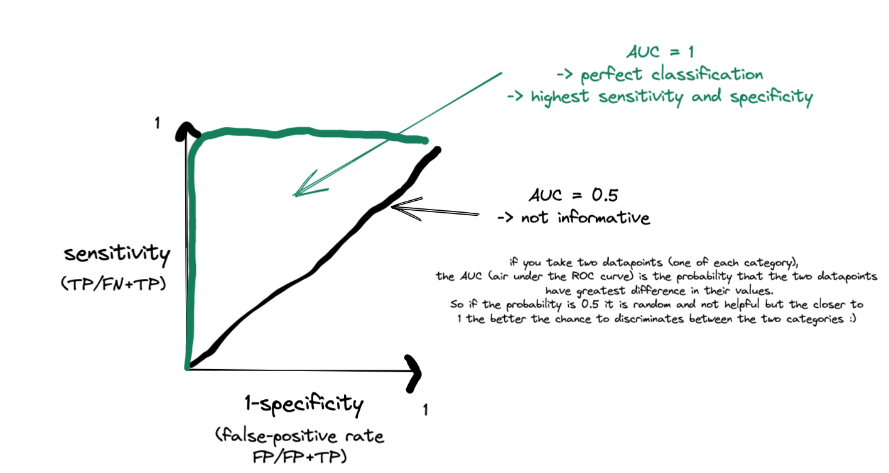

# Questions and Answers to Supervised Learning.

### ROC curves
A wikipedia etry on ROC-curves can be found [here](https://en.wikipedia.org/wiki/Receiver_operating_characteristic)

1. I don't understand why a ROC score above 0.5 is seen as a good predictor?
   >    
   > An uninformative predictor would give a score of 0.5, any performance better than that is better than expected by chance.   
   > In a ROC curve the sensitivity (true positive rate) is plotted against the 1-specificity (false positive rate) of a test (in this case the supervised machine learning program. The curve shows to the results of different tresholds. The Area under the curve says something about the accuracy of the test. The score lays between 0-1. 1 indicating perfect accuracy. How higher the ROC score how more accurate the test. A score of 0.5 suggest ability to diagnose healthy vs unhealthy people. When the score goes above 0.5 there is a ability to distinguish betaeen healthy and unhealthy people. A score between 0.7-0.8 is acceptable, 0.8-0.9 excellent and higher is outstanding. [This article](https://www.sciencedirect.com/science/article/pii/S1556086415306043) helped me understand the ROC plot/score better. Maybe it will help you too.

### Plasticity

1. I was wondering what are the relation between introducing higher dimensions into kernels function in a SVM and the number of neurons in a dense layer neural network. Since for both, if you increment them you start overfitting the data.  In a previous course went through the https://playground.tensorflow.org/ which just as the SVM distinguishes between two populations. And here the similarities between what the SVMs with excessive dimensions and the over fit neural net due to too many neurons become very apparent. So yes, I was just wondering if it is a coincidence, because that is precisely what overfit data is? Or if there is an actual relationship between number of neurons and number of dimentions in these seemingly different approaches?
   > Thanks for the link, I will include it for the section of VAEs.  
   There is indeed a link to the number of parameters of a model and its propensity to overfit data. A famous quote from von Neumann is "with four parameters I can fit an elephant, with five I can make him wiggle his trunk". As we approach ML with as many parameters as a Neural network we need to rely on [regularization](https://en.wikipedia.org/wiki/Regularization_(mathematics)) to not overfit to data, typically so called drop-outs.

### Multiclass SVMs

1. A support vector machine is used when the data has exactly two classes. Why can’t we use it to separate more than two sample groups? Wouldn’t we be able to do that by, for example, adding another separating hyperplane?
   > We can do separation for more than 2 classes using SVM. For instance, one can take a one-vs-all approach when we first separate 1 class from all the rest (considered as one class) and then repeat this process until all the classes are identified. Alternatively, optimization algorithms of SVM can be generalized to multiclass classification.
   > It is worth noting that the book contains an example of [multiclass prediction with SVMs](https://jakevdp.github.io/PythonDataScienceHandbook/05.07-support-vector-machines.html#Example:-Face-Recognition)

### The curse of dimensionality

A nice wikipedia entry describing these problems can be found [here](https://en.wikipedia.org/wiki/Curse_of_dimensionality)

1. In the article of William S Noble it is said that "projecting into very high-dimensional spaces can be problematic, due to the so-called curse of dimensionality: as the number of variables under consideration increases, the number of possible solutions also increases, but exponentially". Therefore it is problematic to select the GOOD solution.   
I am wondering how "different" are those solutions and if we couldn't apply the "maximum margin" principle to select the solution being the most in the middle?
   > I think very different. In the given examples, the clusters are clearly separated which made constructing a clear hyperplane easy. However, in a lot of instances the clusters will not be so easily defined and separated, making the maximum margin principle applicable from various angles, creating multiple solutions. As you can imagine, these solutions will increase tremendously when increasing the dimensions. 

### Tuning of Hyper parameters

The jupyter notebook describes how to tune hyperparameters using GridSearch. There is also a section in VanderPlas describing how to [select the best model](https://jakevdp.github.io/PythonDataScienceHandbook/05.03-hyperparameters-and-model-validation.html#Validation-in-Practice:-Grid-Search). 

1. In the section describing support vector machines, they write that the tuning parameter that controls the hardness of the margin should be tuned using cross-validation or a similar procedure. How is cross-validation used to tune the parameter? How do we make the trade-off between the size of the margin and the hyperplane violations?
  > Cross validation is used to tune the parameter by dividing your data into folds and trying different test/train divisions. For each division you evaluate the result of classification with a number of different tuning parameter values. You can for example look at which accuracy you achieve. Then you can choose the parameter value that gives you the best accuracy, averaged over the different divisions into train/test of your data.    
  The trade-off between margin and violation is specified by this tuning parameter. If this is large, then violations are penalized harshly, if it smaller they are not and a larger margin can be selected as more errors are allowed. The margin and the penalty are evaluated together for different tuning parameter values during the cross validation and then you can select the tuning parameter that allows you to select margins to achieve optimal accuracy (or precision, or recall, or whichever parameter you choose to optimize for).   
  >  > The parameter tuning is performed on the training-dataset. That is, when the coefficients of the support vector machine are set based on the training datapoints. Then, the SVM is tested for how well it can predict the values in the test-dataset (i.e.: RMSE based on the deviation between predicted and actual values).   
  Thus, if you can use the whole dataset to train the model (instead of wasting part of the dataset), you can do parameter-adjustment in more rounds (trails) on the same dataset, and get more possible hyperplane separators from the same amount of data.   
  The trade-off between margin-size and violations is optimized by minimizing the hinge-loss function. That is, we penalize datapoints that cross the separator, but we try to minimize the sum of the penalty score while retaining a large-enough margin.

### Model selection

1. How is the kernel function determined? E.g. how do you find out which mathematical transformation to apply to get linearly-separable data?
   > In the text by Noble it says that a kernel function can be done either using trial and error, starting from a simple SVM and then trying other standard kernel functions (these can potentially be limited  if one knows much about their data). It is also possible to select a kernel function using cross-validation on a fixed set of kernels, this is time consuming and does not always guarantee that another kernel function, not used in the cross-validation, could not be a better choice.

### Division into train and test data

1. Are there any specific rules that we should follow when we are dividing the training sets into bins in nested cross validation?
   > I think the ratio for splitting the data into training and test set in general is an important consideration but to my knowledge there is no official rule because it depends on your data a lot. If you have 100,000 instances, slightly changing the ratio does not have a big impact on your model but if you have only 100 instances every data point is kind of important for your model. In the latter case, cross-validation is a good method for evaluating your model because even though you have only few data points for both your training and test set you can assess if the model makes sense by comparing the validation scores. (like in [VaderPlas section on Model Validation](https://jakevdp.github.io/PythonDataScienceHandbook/05.03-hyperparameters-and-model-validation.html)
   People often use 80% of the data in the training set and 20% in the test set though, which seems to be a good starting point.
   I think the [first answer in this thread](https://stackoverflow.com/questions/13610074/is-there-a-rule-of-thumb-for-how-to-divide-a-dataset-into-training-and-validatio) is helpful.
   > Making splits is a must, and there are obviously plenty of options on how to do them. However, I think it is also important to evenly distribute data across the bins. If we have treatments A, B and C and do a 5-fold split, it would not make sense to have treatment A represented in bins 1 and 2 only. Also, maybe half of the samples have a sequencing depth that is much higher than the rest, this would be yet another characteristic that should be distributed evenly across the bins. The bigger the dataset, the less this is a problem obviously.
   > L: Yet a consideration is that you should strive to avoid having too similar datapoints in your train and test data. Sometimes you see homology filters excluding too similar data points from datasets.

### Cross validation
1. What is the applicatory benefit/limitations between the choices of 3-fold (or even 4-fold or 5 fold) cross validation, or implementing nested validation for training data sets?
   > Selecting a larger number of cross validation bins has the benefit of you traing the model on more data, but the drawback that you have to train more models, i.e. it is slower.

1. Would an x-fold cross-validation (with an increasing number of x) not lead to a bias towards similar data sets, i.e. reducing the "learning impact" of a dissimilar data set?
   > If the data set is not representative of the real world data, yes.

1. In the video (Cross Validation) it is stated that the training set is separated into three cross validation bins and that three different learners are trained and tested on the different bins. What exactly are the learners? Are they connected in some way and for example combined after training/testing of the set or are they used individually as three separate "sets"?
   > Learners in this context could be seen as different estimation models, which you train ("learn") them in. You have your data set, and then you are doing a sequence of fits where each subset of the data is used both as a training set and a validation set. The learners are correlating to each other by the fact that they derive from the same dataset. During your prediction, you'll get (different) outputs from all three, which you then combine and i.e. take the mean from them and based from this get a better estimation of the global models' performance.   
   > L: The outcome of the 3-fold x-validation are three separate classifiers, and their performance figures. There are different strategies for creating a final predictor: 1) Often a final classifier is trained based on all data. However, such a classifier should not be used for reporting performance. 2) One can select one of the predictors, either by random or by its performance. 3) One can use all predictors and use the majority vote between them as a final prediction.

1. In the video you mentioned that to validate the supervised methods we need to train and test with different data sets. In cross validation you present that one can separate the training set into three different parts and perform training and testing on each part. I wonder if there is any assumption for the training set used in this method, or if 3-fold cross validation can be applied on any training set? Wouldn't the result be biased with 3-fold cross validation, since even we separate the data into three parts, all parts are originally from a same training set?
   > Your first two sentences are both correct. I think the key here is that you need to understand the test subset from the training set using cross-validation and the actual test set are two different things (I know it doesn't sound very clear, but we can rename all the sets a bit).   
   In a prediction problem, a model is usually given a dataset of known data (= the actual training set) on which training is run and a dataset of unknown data (= the actual test set) against which the model is tested. And the motivation for using cross-validation is that you want to make the best use of the actual training set. You want to train and tune your model and get an approximation of how well your model will perform. So you will use the “know_data_tranning_subset” to train your model and the “know_data_test_subset” to get the approximate performance of your trained model. But this is not the end; after cross-validation, you still need to know the actual performance of your trained model by using the “unkonwn_data_test_set” to do the testing.    
   So to answer your second question, the result would not be biased because the testing result from cross-validation is just an approximate performance of your model. Instead, cross-validation is a good way to detect overfitting and selection bias by comparing your model's approximate performance and actual performance. For your first question, I think cross-validation can be applied to any training set, but “3-fold” here is just an arbitrary number. It can also be five or other numbers. And there are also some other cross-validation methods, like Leave-one-out cross-validation, k-fold cross-validation, etc. Choosing the best cross-validation method on your dataset really depends on the underlying data distribution.
   Some useful material: (1) What is cross-validation: https://www.youtube.com/watch?v=fSytzGwwBVw; (2) How can cross-validation help us detect overfitting: https://elitedatascience.com/overfitting-in-machine-learning#examples; (3) Different CV methods and codes: https://medium.com/analytics-vidhya/a-complete-guide-to-choose-the-correct-cross-validation-technique-d70810a02f27

1. Would an x-fold cross-validation (with an increasing number of x) not lead to a bias towards similar data sets, i.e. reducing the "learning impact" of a dissimilar data set?
   > The normal view is that the it is not about having independent data sets, but independent data points.    
   > Does not the increasement of folds create more variance between the learnings sets? Thus the the model has seen many more different sets, and are less likely to form a bias towards any of them. 

### Nested Cross-validation.

1. In the video nested cross validation was described, however I don’t really understand why and when to use a nested cross validation over "regular" cross validation. 
  > We use nested cross validation when we do not want to "spend" our test data to tune hyper parameters or selecting kernels based on performance. Under such condition we can further divide our training data. 

### Hyperplanes
1. For the maximum margin hyperplanes, in the lecture is was mentioned that you need three datapoints to determine this. Does anyone understand why you need three instead of two? To me it seems like these planes are symmetrical from the center to the margin boundary, so if you know the margin boundary on one side, you also know it on the other side, implying that two datapoints are sufficient to draw this hyperplane with its margins.
   > Indeed you might only need two points to define a separating line in any dimensionality of the datasets. See [this stack exchange thread](https://stackoverflow.com/questions/9480605/what-is-the-relation-between-the-number-of-support-vectors-and-training-data-and). However, in practice we frequently need more datapoints for defining the boundary.   
   > > This has to do with the support vectors, which are chosen when we decide where the plane is going to be. We create two parallell hyperplanes to separate the data and to find the distance between (and thereby the middle) we use the "distance from a point to a plane" formula which requires three points. It is explained in more detail here: https://en.wikipedia.org/wiki/Support_vector_machine Links to an external site. 

 

### Kernels

1. In the section about support vector machines it is mentioned that a fit on kernel-transformed data can be done implicitly by using the kernel trick. How does this work?
   > It is a [nice piece of mathematics](https://en.wikipedia.org/wiki/Kernel_method#Mathematics:_the_kernel_trick) that speeds up the calculations of the similarities of datapoints in kernel space. In short we can calculate the dot-products in kernelspace as a function of the dot products in feature space. It is well worth studying, but we will not walk it through in the course.

1. Noble mentions that kernels provide a "mathematical formalism for combining different types of data", explaining that we could combine microarray data and MS data on a "joint kernel". How does it happen? 
   > One can combine several kernel functions into one meta-kernel function, which we can use for e.g. SVM training.

1. To draw classifications, we have relied on the hyperplane - the equivalent of a line in higher-dimensional spaces. Are there classifiers that rely instead on curved separations instead? Or is that needlessly complicated, as hyperplanes can have "curved effects", whenever we use kernel functions (as seen in Fig 1k in Noble's paper).
   > There are a plentiora of different types of supervise classifiers available. Many of them are implemented in [scikit-learn](https://scikit-learn.org/stable/supervised_learning.html#supervised-learning). Some of them use linear separation, others operate by other principles. It is worth having a look at them. 

### Feature normalization
[Feature normalization](https://en.wikipedia.org/wiki/Feature_scaling) is standard practice in most ML algorithms. It strives to give all features the same influence on the model by compensating for the difference in magnitude of different features.

1. Regarding the notebook, why do we scale all the gene expression values to a standard deviation of 1 and a mean of 0?
   > In general, before training any machine learning model one should normalize data just because it can come from very different distributions. Here is a nice [blog post on the subject](https://towardsdatascience.com/why-data-should-be-normalized-before-training-a-neural-network-c626b7f66c7d).

### Vanderplas
1. In the section about model validation under "## Validation curves in Scikit-learn", they were calculating both a training score and a validation score and plotted these curves. I have trouble understanding what the model was validated against. Did they withold some data that was not used for the curve fitting?
   > They use one call to generate a training set, `X, y = make_data(40)`. This is the black dots that they report in the figure. Subsequently the evaluate their three polynomials for 500 values evenly distributed from -0.1 to 1.1 `X_test = np.linspace(-0.1, 1.1, 500)[:, None]`. Despite the variable name, these points are not representing a labeled testset, just the points the function is evaluated for.