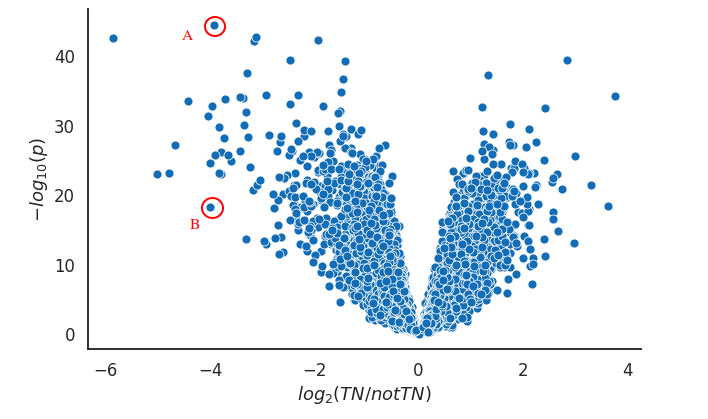
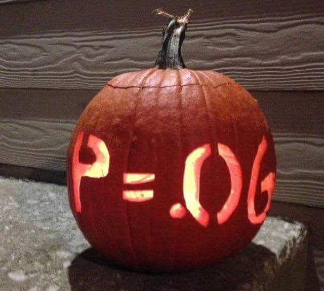
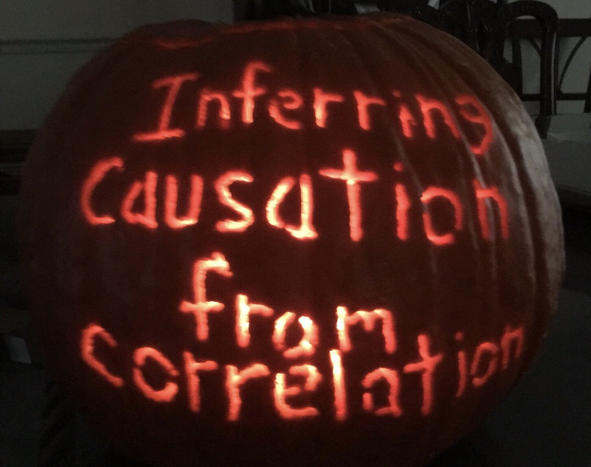

# Question and answers -- Hypothesis Testing

## Test statistic
1. How do you choose your test statistic? For example in chapter 9, the authors chose the mean, but the mean would be largely affected by extreme values and therefore would not be the best choice sometimes. Why not choose the median then? How do we choose between the two?  
> The choice is dependent on how your data is distributed, and how prone you think your data collection is for resulting in outliers.

1. Is it always obvious which test statistic to use, or is it possible that several different test statistics seem equally applicable? And since using different test statistics could result in distinct *p* values, how do we interpret the results in the case of different statistical significance for equally applicable test statistics?
> You could use several different tests, but once you made up your mind you should only use one type of test.

1. In chapter 8, to quantify the sampling error, hypothetical values of mean and variance of the population are chosen to be their corresponding estimates in the sample. That sounds like you are evaluating the veracity of the sample estimates under the assumption that they are the right estimations for the population.  
Why would we do this? Even if the confidence interval is narrow or the standard error is small, I could not conclude that the estimates are right. I could have perfectly picked a group of extreme values (as they suggest with randomly picking 9 heavy gorillas in that same section). Is sampling bias detected by this sampling error quantification?
> Yes, you might detect sampling biases this way. E.g. you could find out if your weighting scale is wrongly calibrated.

## Sampling distributions
1. In 8.3 they use a simulation to answer: “If the actual values of µ and σ were 90 kg and 7.5 kg, and we ran the same experiment many times, how much would the estimated mean, x, vary?”. Not sure I understand how that works and what it means, especially since they use the values from their sample, which could potentially be an extreme value due to sampling error and variation.
> And I am not sure I understand what you do not understand. What they say is that if they know that the population parameters are µ=90 kg and σ=7.5 kg, how would the sample means vary.

1. The sampling distribution gives us a much better estimate of the population statistic than the statistic of just one sample. That makes a lot of sense, since you are basing the conclusion on much more information. But what is the difference between calculating the sampling distribution and just taking a much bigger sample to base your conclusion on? Couldn’t those two options contain an equal amount of information?
> They could be the same thing if done smartely, however, if you just register an average over a larger sample, you might not get the uncertainty of the distribution.

1. In 8.3, the standard error is calculated by taking the mean of the difference between the sample mean and the population mean. The population mean (mu) and standard deviation (sigma) are hypothesized to be the first sample mean calculated, and the standard error calculated from simulated sampling from a normal distribution with those parameters.  
How are we justified in using those values of mu and sigma for both the population mean that creates the normal distribution and the comparison used to calculate the standard error (mu - xbar)? I realize that we cannot know the actual population parameters, nor the actual distribution even, but I’m curious what reasoning we can give for the method of calculating standard error (and why it’s not double-counting the evidence)?

## Definition of *p* values
1. "The *P* value is the probability of getting test results at least as extreme as the actual results, provided the null hypothesis is correct."  
This is the definition in more or less the same word that we always hear when we explain the *p* value. But I have never heard anyone explain what the numbers really stand for with an example. Take a *p* value of 0.05 to identify a protein from a partial sequence.  
Does this mean that we have a 5% chance that the identification is incorrect, which should mean that we have a 95% chance of having identified the correct sequence? and how does this related if we have multiple results with equal or similar *p* values?
> A1. No it does not mean that there is 5% chance that the identification is incorrect. It means that if we repeat the experiment 20 times you would find on average one experiment with as good, or better, identification score, despite the identification is incorrect in all your experiments.  
> A2. It means that you - as the researcher - have set a threshold of 5%, where if the probability that the protein identification by the partial sequencing was made by pure chance was 5% or higher, then the identification is incorrect/non-significant. Many scientists that falsify data, usually choose to raise the threshold value to confirm the significance of their - incorrect/random - results.  
It does not mean, however that there is a 95% chance that the protein identification by the partial sequencing was true, because the p-value is used only for the null-hypothesis and - just like confidence interval - does not take into account the type I and type II errors.

## Uniformity of *p* values

1. It is mentioned in the video that the *p* value is uniformly distributed under the null hypothesis and in the questions it is explained that this is due to the CDF. Is the *p* value still uniformly distributed if the alternative hypothesis is most likely true (i.e. when the null hypothesis is rejected) because the *p* value is calculated based on the null hypothesis?  
Is there a necessity and if so a way to assess whether the *p* value is uniformly distributed and are there conditions/experiments for which we cannot assume a uniformly distributed *p* value?
 > *p* values are uniform under null as the *p* value is defined under null. The probability that a randomly selected person in your class is among the 25% tallest persons in your class is 25%.

 ## One vs. Two sided *p* values

 1. In chapter 9.4, it is explained that the difference between one-sided and two-sided hypothesis testing (of alternative test statistics) is that the latter includes the absolute values thus is twice the size of the one-sided hypothesis. My question here is if there are any methodologies that can help us to choose between one-sided or the two-sided hypothesis testing?
 > A1. It all depends on what you are testing. If you are just testing for e.g. up **or** down regulation of genes, you use a one sided test. If you test for both, you use a two sided test.  
 > A2. According to the literature, two-sided hypothesis testing is used to confirm/reject a novel/unsupported hypothesis. One-sided hypothesis testing is used instead, for hypotheses that are supported by background reasons.

 1. In Section 9.4, we discuss between one-sided and two-sided p tests. In the example we were discussing about the first babies being born late, the one sided test gave a more significant p value.  
 What helps us decide whether we should do a one-sided or a two-sided p test, is it he test statistic we are looking at like (standard deviation, mean) ? Or the question we are trying to answer. Also how is p-value affected depending on if its a one-sided or a two-sided  P test?  
 > Usually, for one-sided p test, p-value is half of the p-value in the two-sided p test, depending on the shape of distribution. I would presume that this division of p-value occurs for normally distributed data.
  > > It is mentioned that a one-sided test is more specific than a two-sided test. It might also depend on what you want to test, whether you want to know how likely it is to obtain a result this far off the mean (long and short pregnancies, two sided) or how likely it is to have such a long or short pregnancy (one sided).

  ## Permutation tests
  1. In chapter 9.3, they write that they model the null hypothesis by permutation. When we say that we model the null hypothesis, is this a way of determining the sampling distribution under the null hypothesis?
  > Yes!

  1. In 9.3 they bring up the concept of doing a null hypothesis test by permutation, and describe that permutation means that we can pool the two sample groups and treat as one group. I wonder what the reason for that is and when it is applicable?
  > If you are under the H0 you should see no difference between case and control. Hence you should be able to switch labels of your samples and get comparative results.

  1. You can calculate a *p* value for non-normally distributed data, but when do we know what kind of data to expect? Could you give an example of when this is applicable, or if not explain why it is always normally distributed?
  > Different populations follow different distributions. They are sometime normal, then you can apply tests like *t* tests. Permutation tests do not make other assumptions of the distributions than that they are equal for case and control.

  1. You can analyze the difference between two samples using *p* values with a *t* test. In the Wikipedia entry about *t* tests, there where many different versions of *t* tests depending on your samples. For example *t* tests for paired samples and for samples of different sizes. Are there any situations when a *t* test cannot be used to analyze the significance of the difference between two samples? Why?
  > The *t* test is only valid if your errors follow a normal distribution.

  1. In 9.3, to test a difference in means between two groups, the null hypothesis is originally assumed that the distributions for two groups are the same. However, the permutation is an approach applied for modelling the null hypothesis, which shuffles the values and treats two groups as one big group. Does it mean that the comparison between two separated groups is replaced by the comparison of one of the groups to the whole group? Thus, in this case, is the null hypothesis still the same as the original one that the distributions for the two groups are the same, or should it be adjusted to consistent with the permutation method because of the changes of the test groups?
  > No you are still comparing two groups.

## Significance levels

1. 
In the provided volcano plot A and B have similar log fold change values but very different *p* values (pa less than 10 -40 and pb more than 10-20). However, in both cases the *p* values are really small. My question is how much weight should someone put in such differences of the *p* value when interpreting results like this.
For example is it better to focus just on A or could we say that A and B have large log fold changes and are both highly significant, therefore we should focus on both?
 > In this particular case the *p* values are so ridiculously low that you should go back to the dataset and check for biases. That said, the purpose of a volcano plot is just this, that you should compare the fold change and significance.

1. The threshold for the significance test depends on the study itself and this bar value can be adjusted from case to case which can unfortunately lead to *p* value abuse. Researchers can change the significance level bar so that the preferable/wanted result can pass under it. How can this be avoided and detected? Is there a rule how to choose a proper significance level?
 > A1. No not really. Normally we say that we should select significance levels before the experiment starts.  
 > A2. If the researcher, whom you suspect has committed *p* value abuse, has published the data of her research - along with the results - then you can use that data to repeat the null hypothesis testing with the default threshold(s) (0.01, 0.05, 0.1). Your results will then show if the researcher abused the *p* value or not.  
 It is harder to detect *p* value abuses if the researcher does not publish the relevant data, however.

 1. In Chapter 9.2, the author states that they recommend you to interpret *p* values according to their order of magnitude because the *p* value chosen to be the threshold for significance is arbitrary. If the *p* value is less than 1%, the effect is unlikely to be due to chance, if it is greater than 10% the effect can plausibly be explained by chance. *p* values between 1% and 10% should be considered borderline, and the data does not provide strong evidence whether the H0 is true or not.  
 What do you do if your *p* value is within the range 1% - 10%? How do you then go about disproving the H0?

## Bayesian methods

1. Is "classical hypothesis testing" always the preferred method for testing a hypothesis or is it sometimes preferred to use different methods such as only Neyman-Pearson or only Bayesian inference?
> What I call "classical hypothesis testing" is the same thing as Neyman-Pearson. In future incarnations of this course we might be able to go through Bayesian Inferences.

## Different tests
1. In the Jupyter notebook on differential expression analysis it is stated that it is generally assumed that expression values follow a log-normal distribution. Why is this the case? Are there any other possible distributions? What are the most common ways to determine the most suitable distribution of gene expression data?
1. Is the log of a normal distribution also a normal distribution? If not, under which conditions?
> It is, if the data follows a [log-normal](https://en.wikipedia.org/wiki/Log-normal_distribution) distribution.

1. There are usually numerous statistical tests that can be applied to the same data set when conducting research. Is there any benefit to run several statistical tests to further strengthen the confidence in your data or is it more valuable to simply chose the test that illustrates the point you want to make the best based your data? If there is a benefit to apply as many tests as you could should you allways do so?  
In short: How extensive should your testing be in number of applied tests?
> Just use one test. The reason for this will become obvious when we discuss multiple testing corrections in the next lecture.

## Correlation
1. In chapter 9.5, testing a correlation, it is mentioned that Pearson's correlation is used on the NSFG data set to test probability of the correlation between birth weight and mother’s age, but that Spearman’s correlation would work as well. Are there situations where we would rather use on of these correlation methods or are they in most cases interchangeable?
> Spearman's correlations are seen as more robust.

1. In chapter 9.5 author tested the significance of correlation using Pearson's correlation, however, very frequently it's said, that correlation does not guarantee causation (e.g. data sets of two different studies might be very similar, but the studies would not be linked by any means). Does this test take it into consideration or is it reliant for a scientist to analyze and optimize it before? Also, is there any real difference between Pearson's correlation and Spearman's correlation to be used?

1. Regarding chapter 9.5 Testing a correlation, is there a limit in what variables can be tested? I don't have an example but I am wondering if it is possible to use this method to show correlation with phenomena that have nothing to do with eachother?
> A1:I think you can probably correlate any two variables, but it simply does not prove a causation link between the two.  
A2: [Sure you can!](https://www.tylervigen.com/spurious-correlations) That does, however, not mean that it is useful to do so.

## Experimental Design

1. Sampling error is an error that is always introduced when one picks out a (random) sample from a population that has a high variability, i.e. when looking at cancer cells that have very high heterogeneity. However, this random error can be minimized by doing this sampling many times ,but who decides on i.e. the number of individuals of the sample, what I mean is given a population size, how can we be justified in our inferences that we are representing the entire population from a relatively small sample size of a much larger population?  
(If the answer is significance testing with *p* value then it could be abused by for example repeating the sampling and yielding a satisfactory *p* value or other types of *p* value abuse).
> This relates to experimental design. The answer is that more samples are better than fewer. Biological replicates are better than technical replicates. See e.g. [Wikipedia](https://en.wikipedia.org/wiki/Design_of_experiments).

1. Confidence intervals and standard errors only quantify sampling error […]. The sampling distribution does not account for other sources of error, notably sampling bias and measurement error (Chapter 8).  
Is there a way to detect and correct for these other sources of error?
> A1. Yes, you can use blocking to account for biases in the measurement procedure. Measurement errors are compensated by increasing sample sizes. See e.g. [Wikipedia](https://en.wikipedia.org/wiki/Design_of_experiments).
> A2. You can use replicate measurements to correct for measurement error I would think :)

1. On Wikipedia it is mentioned that a prerequisite for the exactness of the t-test is that the sample means are normally distributed, and the central limit theorem states that this is the case if the sample size is large enough, even when the individual data values are not normally distributed. The Wikipedia page about the misuse of *p* values also mentions that sample size affects the *p* value. So clearly sample size is an important consideration in hypothesis testing. How do you determine a good (sufficient) sample size?
> See e.g. [Wikipedia](https://en.wikipedia.org/wiki/Design_of_experiments).

1. What are some common sources of sampling error apart from biological variance, i.e. is there something else that I have to think about when constructing a sample subset?
> There are a large number of factors to consider. Enough for a lecture of its own.

## Notebook

1. In the notebook, we only remove NaN and zeroes. Is it also relevant to consider removal of outliers? If so, how do we determine which outlier-conditions to set without compromising the integrity of the data?
> Yes it is. You know an outlier when you see one.

---

1. In the section about standard deviation and standard error in chapter 8.3 of the book, it is mentioned that the standard error decreases with increasing sample size, whereas the standard deviation does not do so.  
When analysing a badly sampled, small-size population, wouldn't the standard deviation also be subject to changes when increasing the sample population? To build up on the gorilla example for instance, if the original sample population would only consist of some of the lightest and some of the heaviest animals, adding more medium-sized gorillas to increase the sample population would reduce the standard deviation. In that case, wouldn't it be possible to use the standard deviation as an indicator of sufficient population size, i.e. if the standard deviation does not change anymore when adding new gorillas, a sufficiently representative population size has been found?

1. There are different significance tests to calculate the p-value, for example t-test. How do we choose which statistical test to use? Are there any test statistics that are more common and appropriate in biological research or does that depend more on the research question or our data set?

1. In the lecture video you mentioned that there can be biological variation (between the individuals) and technical variation (in the measurement process), what can be examples of these types of variations? and how can they be avoided/dealt with?

1. In this preparatory material, student's t-distribution is mentioned for the distribution of the samples. Are there cases, however, within biotechnology, where this distribution cannot help us?  
Which other distributions models can be used then?  
Optional question: Should we consider the programming code as well, when we read the "hypothesis testing" or can there be easier codes for statistical models?

1. The preparatory text states that a p-value between 1-10% are "borderline" between statistically significant and insignificant. As this is a rather wide border, does the way one handles such a result differ greatly depending on where in the interval the p-value is?

1. The author in the chapter 9.1 uses a combination of three different strategies referring to them as the Classical approach.  
Are there more acceptable combinations of different approaches? If so, could you gives us examples of which ones and instances they could be used?
> Not sure what you mean. Downey presents one framework for testing.

1. How can the sampling error be reduced with the same sample size? Are the individuals of a sample from a population always randomly selected?

1. When taking a random sample, how do we avoid sampling errors to an as big degree as possible? Should we be “not completely random”, through e.g. picking a certain number of people from all age groups “on purpose”? Then pick a certain number of individuals based on gender, etc? Should we classify individuals in the two populations and then randomly pick equal numbers from each category in both populations? Or what does it actually mean to take a random sample, while still trying to avoid sampling errors (confounders)? Should we just assume that, statistically if we take a big enough sample, we will pick approximately equal numbers of individuals from the different categories without doing it consciously?

1. The reading material talks about the errors that random sampling can introduce. Other than optimising the sampling size to try to reduce the sampling bias and other errors, are there other methods that we can implement to reduce these errors during sampling?  
Additionally, how do we decide what is a 'good' sample size?

1. In the book 8.3, to get a sample distribution, we choose n values from a normal distribution with the given parameters(mean and standard deviation, from the sample). Then the sample distribution is the basement for the p-value (in the videos). What if the population features are not distributed with normal distribution? Or the hypothesis testing is only suitable for the population features that are normal distributed.

----

1. The way I understand it, p-value depends on the iterations, so the number of times an experiment is made. Taking this into account, how can we be sure that p-value is reliable? Is there any way to overcome or limit this uncertainty?  

1. In chapter 8, It explains how increasing samples can minimize the sampling bias and measurement errors. I think increasing samples also grows variances and eventually threatens the assumption of similarity, How can It be solved when it comes to robustness of samples.
